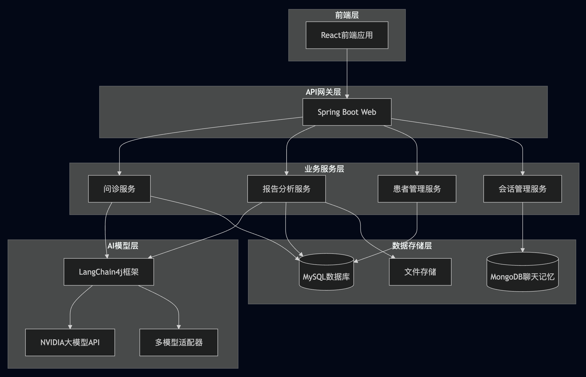
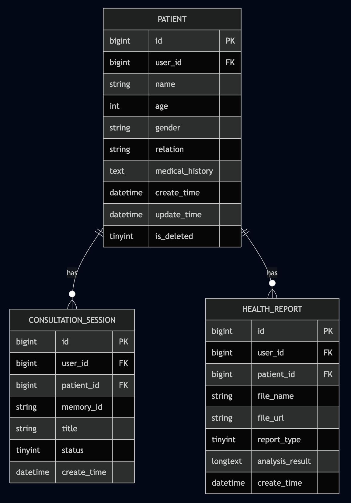
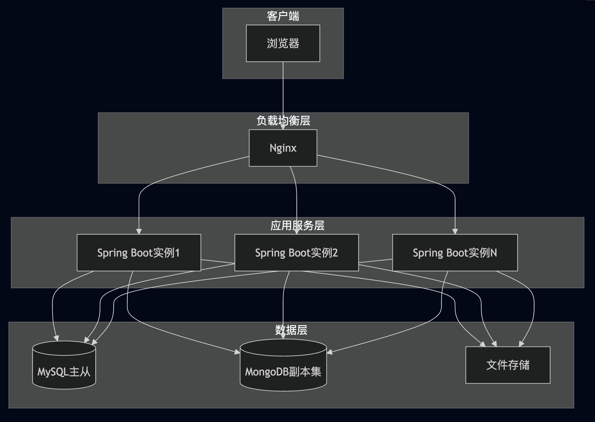

# AI健康问诊平台技术方案文档

## 1. 系统架构设计

### 1.1 系统架构图



### 1.2 领域和服务拆分

#### 1.2.1 核心领域
- **患者管理域**：负责就诊人信息管理
- **问诊会话域**：负责AI问诊会话管理
- **报告分析域**：负责医学报告上传、解析和分析
- **AI交互域**：负责与大模型的交互

#### 1.2.2 服务依赖关系
- 前端React应用通过REST API与后端Spring Boot服务交互
- 所有业务服务通过LangChain4j框架与多种AI模型交互
- 问诊会话服务使用MongoDB存储聊天记忆
- 其他业务服务使用MySQL存储结构化数据
- 报告分析服务将上传的文件存储到本地文件系统

## 2. 技术选型

### 2.1 前端技术栈
- **框架**：React 19.x + Vite
- **路由**：React Router DOM
- **HTTP客户端**：Axios
- **构建工具**：Vite
- **代码规范**：ESLint

### 2.2 后端技术栈
- **框架**：Spring Boot 3.2.6
- **语言**：Java 17
- **AI框架**：LangChain4j 1.0.0-beta3
- **数据库ORM**：MyBatis-Plus 3.5.11
- **API文档**：Knife4j (Swagger增强版)
- **响应式编程**：Spring WebFlux

### 2.3 数据库和存储
- **关系型数据库**：MySQL 8+
- **文档数据库**：MongoDB (聊天记忆存储)
- **文件存储**：本地文件系统

### 2.4 AI模型支持
- **主模型**：NVIDIA API (moonshotai/kimi-k2-instruct)
- **嵌入模型**：NVIDIA API (nvidia/nv-embed-v1)
- **备选模型**：支持OpenAI兼容接口、Ollama本地模型、阿里云百炼平台

### 2.5 中间件和工具
- **文档解析**：Apache PDFBox
- **向量存储**：Pinecone (配置中支持)
- **知识库**：RAG (检索增强生成)

## 3. API接口设计

### 3.1 接口概览

| 模块 | 接口路径 | 方法 | 描述 |
|------|----------|------|------|
| 患者管理 | /api/patient | GET | 获取就诊人列表 |
| 患者管理 | /api/patient | POST | 创建就诊人 |
| 患者管理 | /api/patient/{id} | GET | 获取就诊人详情 |
| 患者管理 | /api/patient/{id} | PUT | 更新就诊人 |
| 患者管理 | /api/patient/{id} | DELETE | 删除就诊人 |
| 问诊会话 | /api/consultation/create | POST | 创建问诊会话 |
| 问诊会话 | /api/consultation | GET | 获取问诊会话列表 |
| 报告分析 | /api/report/uploadAndAnalyze | POST | 上传并分析医学报告 |

### 3.2 请求/响应格式

#### 统一响应格式
```json
{
  "code": 0,
  "message": "success",
  "data": {},
  "success": true
}
```

#### 错误响应格式
```json
{
  "code": 400,
  "message": "错误信息",
  "data": null,
  "success": false
}
```

### 3.3 核心接口详情

#### 3.3.1 创建就诊人
- **URL**: `/api/patient`
- **Method**: POST
- **Request Body**:
```json
{
  "userId": 123,
  "name": "张三",
  "age": 35,
  "gender": "男",
  "relation": "本人",
  "medicalHistory": "高血压病史"
}
```

#### 3.3.2 上传并分析报告
- **URL**: `/api/report/uploadAndAnalyze`
- **Method**: POST
- **Content-Type**: multipart/form-data
- **Parameters**:
  - userId: 用户ID
  - patientId: 患者ID
  - reportType: 报告类型(1-体检, 2-化验, 3-影像)
  - file: 上传的文件

## 4. 数据库设计

### 4.1 ER图



### 4.2 表结构说明

#### 4.2.1 就诊人表 (patient)
- **主键**: id (自增)
- **索引**: 
  - idx_patient_user_id (user_id)
  - idx_patient_user_create_time (user_id, create_time)
- **用途**: 存储用户添加的就诊人信息

#### 4.2.2 问诊会话表 (consultation_session)
- **主键**: id (自增)
- **唯一索引**: uk_consultation_memory_id (memory_id)
- **索引**:
  - idx_consultation_user_id (user_id)
  - idx_consultation_patient_id (patient_id)
  - idx_consultation_user_create_time (user_id, create_time)
- **用途**: 存储AI问诊会话记录，关联MongoDB中的聊天记忆

#### 4.2.3 健康报告表 (health_report)
- **主键**: id (自增)
- **索引**:
  - idx_report_user_id (user_id)
  - idx_report_patient_id (patient_id)
  - idx_report_user_patient (user_id, patient_id)
  - idx_report_create_time (create_time)
- **用途**: 存储上传的医学报告及其AI分析结果

### 4.3 MongoDB集合
- **chat_memory_db**: 存储LangChain4j的聊天记忆，用于会话上下文维护

## 5. 非功能性设计

### 5.1 性能指标目标

#### 5.1.1 响应时长
- **API响应时间**: P95 < 2秒
- **AI交互响应**: 流式输出，首字响应 < 3秒
- **报告解析**: 简单文本 < 1秒，复杂PDF < 5秒

#### 5.1.2 吞吐量
- **并发用户数**: 支持100+并发用户
- **QPS目标**: 基础API接口 > 500 QPS
- **AI交互**: 受限于外部API配额

### 5.2 兼容性要求

#### 5.2.1 浏览器兼容性
- **现代浏览器**: Chrome 80+, Firefox 75+, Safari 13+, Edge 80+
- **移动设备**: iOS Safari 13+, Android Chrome 80+

#### 5.2.2 API兼容性
- **RESTful设计**: 遵循RESTful API设计规范
- **版本控制**: URL版本控制 (/api/v1/)
- **向后兼容**: 接口变更保持向后兼容

### 5.3 监控与告警方案

#### 5.3.1 应用监控
- **Spring Boot Actuator**: 健康检查、指标收集
- **日志监控**: 结构化日志输出
- **性能监控**: 接口响应时间、错误率

#### 5.3.2 告警机制
- **错误率告警**: 5分钟内错误率 > 5%
- **响应时间告警**: P95响应时间 > 5秒
- **资源使用告警**: CPU使用率 > 80%，内存使用率 > 85%

## 6. 部署与运维方案

### 6.1 部署架构


### 6.2 CI/CD流程

#### 6.2.1 前端部署流程
1. **代码提交**: 开发者提交代码到Git仓库
2. **构建**: Vite构建生产版本
3. **测试**: 运行单元测试和集成测试
4. **部署**: 将构建产物部署到Nginx服务器

#### 6.2.2 后端部署流程
1. **代码提交**: 开发者提交代码到Git仓库
2. **构建**: Maven构建JAR包
3. **测试**: 运行单元测试和集成测试
4. **镜像**: 构建Docker镜像
5. **部署**: 部署到应用服务器

### 6.3 回滚方案

#### 6.3.1 应用回滚
- **蓝绿部署**: 同时运行两个版本，切换流量实现零停机回滚
- **滚动回滚**: 逐步替换实例，发现问题可立即停止
- **版本标签**: 每个部署版本都有唯一标签，支持快速回滚

#### 6.3.2 数据回滚
- **数据库备份**: 每日自动备份，保留7天
- **增量备份**: 每小时增量备份
- **快速恢复**: 支持按时间点恢复数据

### 6.4 环境配置

#### 6.4.1 开发环境
- **数据库**: 本地MySQL + MongoDB
- **AI模型**: 使用NVIDIA API测试环境
- **文件存储**: 本地文件系统

#### 6.4.2 生产环境
- **数据库**: 云数据库RDS + MongoDB Atlas
- **AI模型**: 生产环境NVIDIA API
- **文件存储**: 云存储服务
- **监控**: 集成云监控服务

## 7. 总结

本技术方案基于现有的AI健康问诊平台项目，采用前后端分离架构，前端使用React+Vite，后端使用Spring Boot+LangChain4j。系统支持多种AI模型，具备患者管理、问诊会话、报告分析等核心功能。通过合理的架构设计和非功能性考虑，确保系统具备良好的性能、可扩展性和可维护性。